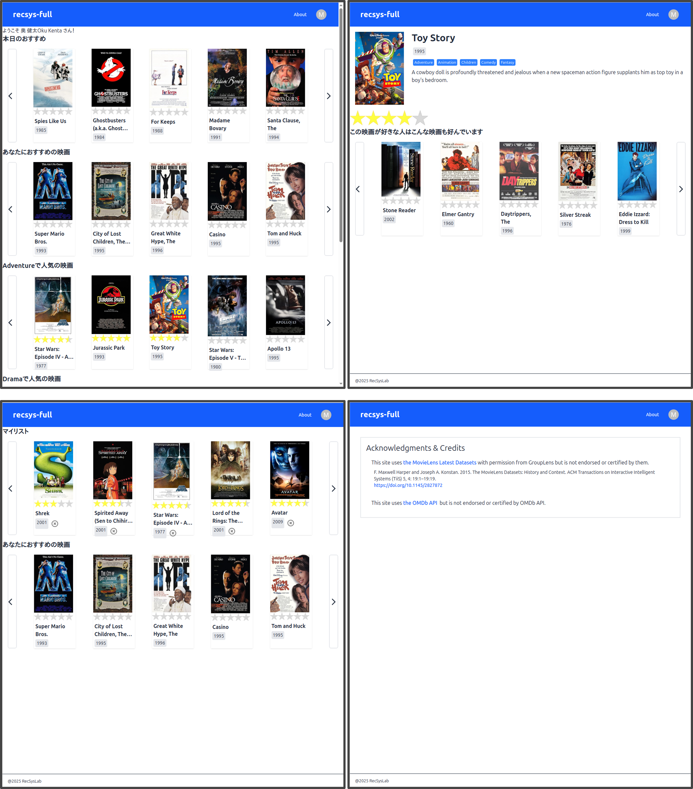



# recsys-full | フルスタック推薦システム開発チュートリアル

## 概要

recsys-full は[recsys-django](https://recsyslab.github.io/recsys-django/)の後継版です。フロントエンドからバックエンド、データベース、オフライン処理までを含んだフルスタック推薦システム開発のチュートリアルです。推薦システムの開発演習を通して、Web アプリケーションの開発方法を学習できる内容となっています。

## 動機

研究室で推薦システムの実装を通して Web アプリケーションの開発方法を学習してもらうために作成しました。個人での学習に加え、大学での授業や研究室等でご活用いただければ幸いです。

## 到達目標

- TypeScript、React、Next.js によるフロントエンド開発の基本を修得できる。
- TailwindCSS によるスタイリングの基本を修得できる。
- NextAuth によるユーザ認証の基本を修得できる。
- Django によるバックエンド開発の基本を修得できる。
- 推薦ライブラリ RecBole による推薦アルゴリズム実装の基本を修得できる。
- MovieLens データセットを用いながら PostgreSQL によるデータベース操作の基本を修得できる。
- OMDb API を用いながら RESTful API によるデータ取得方法を修得できる。
- フロントエンド、バックエンドのデプロイ方法を修得できる。

## 取り組み方

下記の目次に記載している手順にしたがってチュートリアルに取り組んでください。チュートリアルどおりにコードを打ち込んでいくことで、次の**完成イメージ**に示すような推薦システムが出来上がります。詳細な解説はありませんが、各ページに参考文献も示していますので、併せて参照してください。

### 完成イメージ

※インタフェース中の映画ポスター画像は OMDb API により取得

このシステムの主な機能は以下のとおりです。

- トップページにアクセスすることで、「本日のおすすめ」（**ランダム推薦システム**）、「あなたにおすすめの映画」（**BPR ベース推薦システム**、サインイン時））、「ジャンルごとの人気の映画」（**人気ベース推薦システム**）の各推薦リストが提示されます。
- 推薦リストの左右のボタンをクリックすることで、推薦リスト内の提示アイテムを切り替えることができます。
- アイテムをクリックすることで、そのアイテムの詳細ページを閲覧することができます。
- アイテム詳細ページにおいて、「この映画が好きな人はこんな映画も好んでいます」のように、**映画類似度ベース推薦システム**に基づく推薦リストが提示されます。
- 右上の**Sign In**ボタンからサインインすることができます。
- サインインすることで、各アイテムに対して評価値を付与することができます。
- サインイン時、右上のアカウントメニューから**My page**を開くことができます。**My page**では、評価値を付与した映画リストがマイリストとして提示されます。また、「あなたにおすすめの映画」として、個人化された推薦リスト（**BPR ベース推薦システム**）が提示されます。

### 動作確認

本チュートリアルは以下の環境で動作確認しています。

- Linux Mint 22.3
- PostgreSQL 16.15
- Python 3.12.6
- yarn 1.22.22
- Node.js 24.20.0
- React 19.2.8
- Next.js 16.3.3
- TailwindCSS 4
- Django 6.1
- PyTorch 2.13.0
- RecBole 1.2.0
- Google Chrome 152.0.7977.64

## 目次

- 00: [基本事項](docs/ja/基本事項.md)

### 開発環境

- 01: [開発環境の構築](docs/ja/開発環境の構築.md)
- 02: [VSCode の設定](docs/ja/VSCodeの設定.md)

### データ前処理

#### オフライン処理

- 03: [オフライン処理の準備](docs/ja/オフライン処理の準備.md)
- 04: [MovieLens データベースの準備](docs/ja/MovieLensデータベースの準備.md)
- 05: [MovieLens データセットの取込み](docs/ja/MovieLensデータセットの取込み.md)
- 06: [推薦処理用のデータの準備](docs/ja/推薦処理用のデータの準備.md)

### 推薦処理

#### オフライン処理

- 07: [推薦システムの実行](docs/ja/推薦システムの実行.md)

### 準備

#### バックエンド

- 08: [バックエンド開発の準備](docs/ja/バックエンド開発の準備.md)
- 09: [online アプリケーションの作成](docs/ja/onlineアプリケーションの作成.md)

### 認証

- 10: [暗号化の設定](docs/ja/暗号化の設定.md)
- 11: [認証用アプリケーションの作成](docs/ja/認証用アプリケーションの作成.md)
- 12: [カスタムユーザモデルの定義](docs/ja/カスタムユーザモデルの定義.md)
- 13: [ユーザモデルの定義](docs/ja/ユーザモデルの定義.md)
- 14: [認証の準備](docs/ja/認証の準備.md)
- 15: [サインアップビューの作成](docs/ja/サインアップビューの作成.md)
- 16: [サインインビューの作成](docs/ja/サインインビューの作成.md)
- 17: [サインアウトビューの作成](docs/ja/サインアウトビューの作成.md)
- 18: [マイアカウントビューの作成](docs/ja/マイアカウントビューの作成.md)
- 19: [管理サイト](docs/ja/管理サイト.md)
- 20: [CORS への対応](docs/ja/CORSへの対応.md)

#### フロントエンド

- 21: [フロントエンド開発の準備](docs/ja/フロントエンド開発の準備.md)
- 22: [インデックスページの作成](docs/ja/インデックスページの作成.md)
- 23: [共通レイアウトの作成](docs/ja/共通レイアウトの作成.md)
- 24: [TailwindCSS の適用](docs/ja/TailwindCSSの適用.md)
- 25: [定数の定義](docs/ja/定数の定義.md)
- 26: [About ページの作成](docs/ja/Aboutページの作成.md)

### 認証

#### フロントエンド

- 27: [アカウントメニューの作成](docs/ja/アカウントメニューの作成.md)
- 28: [API クライアントの実装](docs/ja/APIクライアントの実装.md)
- 29: [認証 API の実装](docs/ja/認証APIの実装.md)
- 30: [サインアップページの作成](docs/ja/サインアップページの作成.md)
- 31: [サインインページの作成](docs/ja/サインインページの作成.md)
- 32: [認証用ボタンの追加](docs/ja/認証用ボタンの追加.md)
- 33: [認証状態の判定](docs/ja/認証状態の判定.md)
- 34: [セッションの取得](docs/ja/セッションの取得.md)

### 映画

#### バックエンド

- 35: [モデルの定義](docs/ja/モデルの定義.md)
- 36: [データの登録とクエリセット API](docs/ja/データの登録とクエリセットAPI.md)
- 37: [マッパー](docs/ja/マッパー.md)
- 38: [映画リストビューの作成](docs/ja/映画リストビューの作成.md)
- 39: [映画ビューの作成](docs/ja/映画ビューの作成.md)

#### フロントエンド

- 40: [映画リストコンポーネントの作成](docs/ja/映画リストコンポーネントの作成.md)
- 41: [ページネーションの作成](docs/ja/ページネーションの作成.md)
- 42: [ページサイズの動的調整](docs/ja/ページサイズの動的調整.md)
- 43: [映画 API の実装](docs/ja/映画APIの実装.md)
- 44: [映画詳細ページの作成](docs/ja/映画詳細ページの作成.md)
- 45: [エラーページの作成](docs/ja/エラーページの作成.md)
- 46: [ローディングの作成](docs/ja/ローディングの作成.md)
- 47: [NotFound ページの作成](docs/ja/NotFoundページの作成.md)

### 評価値

#### バックエンド

- 48: [評価値の登録と取得](docs/ja/評価値の登録と取得.md)

#### フロントエンド

- 49: [評価値コンポーネントの作成](docs/ja/評価値コンポーネントの作成.md)
- 50: [映画カードへの評価値コンポーネントの追加](docs/ja/映画カードへの評価値コンポーネントの追加.md)
- 51: [評価値の登録](docs/ja/評価値の登録.md)
- 52: [評価値の取得](docs/ja/評価値の取得.md)

#### バックエンド - フロントエンド

- 53: [ユーザ依存の評価値の取得](docs/ja/ユーザ依存の評価値の取得.md)

### 推薦リスト

#### バックエンド - フロントエンド

- 54: [人気ベース推薦システム](docs/ja/人気ベース推薦システム.md)
- 55: [映画類似度ベース推薦システム](docs/ja/映画類似度ベース推薦システム.md)
- 55: [BPR ベース推薦システム](docs/ja/BPRベース推薦システム.md)

### マイリスト

#### バックエンド - フロントエンド

- 56: [マイリスト](docs/ja/マイリスト.md)
- 57: [マイリストからの評価値の削除](docs/ja/マイリストからの評価値の削除.md)

### 更新

#### オフライン処理

- 58: [モデルの更新](docs/ja/モデルの更新.md)

### OMDb API

#### フロントエンド

- 59: [OMDb API](docs/ja/OMDb_API.md)

#### デプロイ

- 60: [バックエンドサーバの準備](docs/ja/バックエンドサーバの準備.md)
- 61: [バックエンドのデプロイ](docs/ja/バックエンドのデプロイ.md)
- 62: [フロントエンドのデプロイ](docs/ja/フロントエンドのデプロイ.md)
- 63: [デプロイ後のモデル更新](docs/ja/デプロイ後のモデル更新.md)

## 参考

### 推薦システムの基礎

1. 奥健太，『基礎から学ぶ推薦システム ～情報技術で嗜好を予測する～』，コロナ社，2022．
1. 廣瀬英雄，『推薦システム ―マトリクス分解の多彩なすがた―』，共立出版，2022．

### 推薦システムの実装

1. 風間正弘，飯塚洸二郎，松村優也，『著推薦システム実践入門 ―仕事で使える導入ガイド』，オライリー・ジャパン，2022．
1. 与謝秀作，『特集 3 最新レコメンドエンジン総実装 協調フィルタリングから深層学習まで』，WEB+DB PRESS Vol.129，pp.69-100，技術評論社，2022．
1. Kim Falk, ``Practical Recommender Systems’‘, MANNING, 2019.

### Web アプリケーション開発

1. 株式会社オープントーン，佐藤大輔，伊東直喜，上野啓二，『実装で学ぶフルスタック Web 開発 エンジニアの視野と知識を広げる「一気通貫」型ハンズオン』，翔泳社，2023．
1. 手島拓也，吉田健人，高林佳稀，『TypeScript と React/Next.js でつくる 実践 Web アプリケーション開発』，技術評論社，2022．
1. チーム・カルポ，『Django4 Web アプリ開発 実装ハンドブック』，秀和システム，2022．
1. 横瀬明仁，『現場で使える Django の教科書《基礎編》』，2018．
1. 横瀬明仁，『現場で使える Django の教科書《実践編》』，2018．
1. [【Next.js13】最新バージョンの Next.js13 をマイクロブログ構築しながら基礎と本質を学ぶ講座 \| Udemy](https://www.udemy.com/course/nextjs13_learning_with_microblog/)
1. [【React アプリ開発】3 種類の React アプリケーションを構築して、React の理解をさらに深めるステップアップ講座 \| Udemy](https://www.udemy.com/course/react-3project-app-udemy/)

### 公式ドキュメント・チュートリアル

1. [React リファレンス概要 – React](https://ja.react.dev/reference/react)
1. [Docs \| Next.js](https://nextjs.org/docs)
1. [Auth.js \| Overview](https://authjs.dev/reference/overview)
1. [Installation - Tailwind CSS](https://tailwindcss.com/docs/installation)
1. [Overview - Material UI](https://mui.com/material-ui/getting-started/)
1. [Django ドキュメント \| Django documentation \| Django](https://docs.djangoproject.com/ja/5.1/)

### データセット、ライブラリ、API

1. [MovieLens \| GroupLens](https://grouplens.org/datasets/movielens/)
1. [RecBole v1.2.0 — RecBole 1.2.0 documentation](https://recbole.io/docs/index.html)
1. [OMDb API - The Open Movie Database](https://www.omdbapi.com/)

### AI

1. [ChatGPT \| OpenAI](https://openai.com/ja-JP/chatgpt/overview/)
1. [Claude Code \| Anthropic](https://code.claude.com/docs/ja/overview)

## Acknowledgments & Credits

This site uses [the MovieLens Latest Datasets](https://grouplens.org/datasets/movielens/latest/) with permission from GroupLens but is not endorsed or certified by them.

1. F. Maxwell Harper and Joseph A. Konstan. 2015. The MovieLens Datasets: History and Context. ACM Transactions on Interactive Intelligent Systems (TiiS) 5, 4: 19:1–19:19. [https://doi.org/10.1145/2827872](https://dl.acm.org/doi/10.1145/2827872)

This site uses [the OMDb API](https://www.omdbapi.com/) but is not endorsed or certified by OMDb API.

## 更新情報

- 2025-04-05: recsys-fullを公開
- 2026-09-02: recsys-fullを全体的に再作成

## 作成者

龍谷大学 [推薦システム研究室](https://recsyslab.org/) 奥 健太
