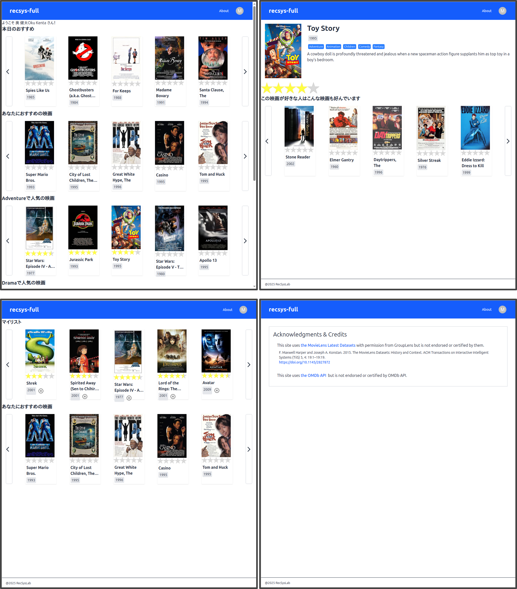



# recsys-full | フルスタック推薦システム開発チュートリアル

## 概要
recsys-fullは[recsys-django](https://recsyslab.github.io/recsys-django/)の後継版です。フロントエンドからバックエンド、データベース、オフライン処理までを含んだフルスタック推薦システム開発のチュートリアルです。推薦システムの開発演習を通して、Webアプリケーションの開発方法を学習できる内容となっています。

## 動機
研究室で推薦システムの実装を通してWebアプリケーションの開発方法を学習してもらうために作成しました。個人での学習に加え、大学での授業や研究室等でご活用いただければ幸いです。

## 到達目標
- TypeScript、React、Next.jsによるフロントエンド開発の基本を修得できる。
- TailwindCSSによるスタイリングの基本を修得できる。
- NextAuthによるユーザ認証の基本を修得できる。
- Djangoによるバックエンド開発の基本を修得できる。
- 推薦ライブラリRecBoleによる推薦アルゴリズム実装の基本を修得できる。
- MovieLensデータセットを用いながらPostgreSQLによるデータベース操作の基本を修得できる。
- OMDb APIを用いながらRESTful APIによるデータ取得方法を修得できる。

## 取り組み方
下記の目次に記載している手順にしたがってチュートリアルに取り組んでください。チュートリアルどおりにコードを打ち込んでいくことで、次の**完成イメージ**に示すような推薦システムが出来上がります。詳細な解説はありませんが、各ページに参考文献も示していますので、併せて参照してください。

### 完成イメージ

※インタフェース中の映画ポスター画像はOMDb APIにより取得

このシステムの主な機能は以下のとおりです。
- トップページにアクセスすることで、「本日のおすすめ」（**ランダム推薦システム**）、「ジャンルごとの人気の映画」（**人気ベース推薦システム**）の各推薦リストが提示されます。
- ページネーションにより、推薦リストの左右のボタンをクリックすることで、推薦リスト内の提示アイテムを切り替えることができます。
- 映画カードをクリックすることで、その映画の詳細ページを閲覧することができます。
- 映画詳細ページにおいて、「この映画が好きな人はこんな映画も好んでいます」のように、**映画-映画類似度ベース推薦システム**に基づく推薦リストが提示されます。
- 右上の**Sign In**ボタンからGoogle認証によりサインインすることができます。
- サインインすることで、トップページに「あなたにおすすめの映画」（**BPRによる個人化推薦システム**）の推薦リストが提示されるようになります。また、各アイテムに対して評価値を付与することができます。
- サインイン時、右上のアカウントメニューから**My page**を開くことができます。**My page**では、評価値を付与した映画リストがマイリストとして提示されます。また、ここでも「あなたにおすすめの映画」（**BPRによる個人化推薦システム**）の推薦リストが提示されます。

### 動作確認
本チュートリアルは以下の環境で動作確認しています。チュートリアルどおりに進めてもうまく動作しない場合は、それぞれ下記のバージョンに合わせることを推奨します。
- Linux Mint 22
- PostgreSQL 16.8
- Python 3.12.6
- yarn 1.22.22
- Node.js 20.19.0
- React 19.0.0
- Next.js 15.2.4
- TailwindCSS 4.0.15
- Django 5.2
- PyTorch 2.5.1
- RecBole 1.2.0
- Google Chrome 134.0.6998.88

## 目次
- [基本事項](基本事項.md)

### 開発環境
1. [開発環境の構築](開発環境の構築.md)
1. [VSCodeの設定](VSCodeの設定.md)

### データ前処理
#### オフライン処理
1. [オフライン処理の準備](オフライン処理の準備.md)
1. [MovieLensデータベースの準備](MovieLensデータベースの準備.md)
1. [MovieLensデータセットの取込み](MovieLensデータセットの取込み.md)
1. [推薦処理用のデータの準備](推薦処理用のデータの準備.md)

### 推薦処理
#### オフライン処理
1. [推薦システムの実行](推薦システムの実行.md)

### 準備
#### フロントエンド
1. [フロントエンド開発の準備](フロントエンド開発の準備.md)
1. [インデックスページの作成](インデックスページの作成.md)
1. [共通レイアウトの作成](共通レイアウトの作成.md)
1. [TailwindCSSの適用](TailwindCSSの適用.md)
1. [Aboutページの作成](Aboutページの作成.md)

#### バックエンド
1. [バックエンド開発の準備](バックエンド開発の準備.md)
1. [onlineアプリケーションの作成](onlineアプリケーションの作成.md)
1. [CORSへの対応](CORSへの対応.md)
1. [暗号化の設定](暗号化の設定.md)

### 認証
#### バックエンド
1. [ユーザモデルの定義](ユーザモデルの定義.md)
1. [ユーザビューの実装](ユーザビューの実装.md)

#### フロントエンド
1. [NextAuthのインストール](NextAuthのインストール.md)
1. [アカウントメニューの作成](アカウントメニューの作成.md)
1. [サインイン・サインアウトボタンの追加](サインイン・サインアウトボタンの追加.md)
1. [Google OAuthクライアントの作成](Google_OAuthクライアントの作成.md)
1. [認証状態の判定](認証状態の判定.md)
1. [セッションの取得](セッションの取得.md)
1. [リソースの保護](リソースの保護.md)
1. [APIクライアントの実装](APIクライアントの実装.md)
1. [ユーザAPIの実装](ユーザAPIの実装.md)

### 映画
#### バックエンド
1. [モデルの定義](モデルの定義.md)
1. [データの登録とクエリセットAPI](データの登録とクエリセットAPI.md)
1. [マッパー](マッパー.md)
1. [映画リストビューの作成](映画リストビューの作成.md)
1. [映画ビューの作成](映画ビューの作成.md)

#### フロントエンド
1. [映画リストコンポーネントの作成](映画リストコンポーネントの作成.md)
1. [ページネーションの作成](ページネーションの作成.md)
1. [映画APIの実装](映画APIの実装.md)
1. [映画詳細ページの作成](映画詳細ページの作成.md)
1. [エラーページの作成](エラーページの作成.md)
1. [ローディングの作成](ローディングの作成.md)
1. [NotFoundページの作成](NotFoundページの作成.md)

### 評価値
#### バックエンド
1. [評価値の登録と取得](評価値の登録と取得.md)

#### フロントエンド
1. [評価値コンポーネントの作成](評価値コンポーネントの作成.md)
1. [映画カードへの評価値コンポーネントの追加](映画カードへの評価値コンポーネントの追加.md)
1. [評価値の登録](評価値の登録.md)
1. [評価値の取得](評価値の取得.md)

#### バックエンド - フロントエンド
1. [ユーザ依存の評価値の取得](ユーザ依存の評価値の取得.md)

### 推薦リスト
#### バックエンド - フロントエンド
1. [人気ベース推薦システム](人気ベース推薦システム.md)
1. [映画-映画類似度ベース推薦システム](映画-映画類似度ベース推薦システム.md)
1. [BPRベース推薦システム](BPRベース推薦システム.md)

### マイリスト
#### バックエンド - フロントエンド
1. [マイリスト](マイリスト.md)
1. [マイリストからの評価値の削除](マイリストからの評価値の削除.md)

### 更新
#### オフライン処理
1. [モデルの更新](モデルの更新.md)

### OMDb API
#### フロントエンド
1. [OMDb API](OMDb_API.md)

## 参考

### 推薦システムの基礎
1. 奥健太，『基礎から学ぶ推薦システム ～情報技術で嗜好を予測する～』，コロナ社，2022．
1. 廣瀬英雄，『推薦システム ―マトリクス分解の多彩なすがた―』，共立出版，2022．

### 推薦システムの実装
1. 風間正弘，飯塚洸二郎，松村優也，『著推薦システム実践入門 ―仕事で使える導入ガイド』，オライリー・ジャパン，2022．
1. 与謝秀作，『特集3 最新レコメンドエンジン総実装 協調フィルタリングから深層学習まで』，WEB+DB PRESS Vol.129，pp.69-100，技術評論社，2022．
1. Kim Falk, ``Practical Recommender Systems’‘, MANNING, 2019.

### Webアプリケーション開発
1. 株式会社オープントーン，佐藤大輔，伊東直喜，上野啓二，『実装で学ぶフルスタックWeb開発 エンジニアの視野と知識を広げる「一気通貫」型ハンズオン』，翔泳社，2023．
1. 手島拓也，吉田健人，高林佳稀，『TypeScriptとReact/Next.jsでつくる 実践Webアプリケーション開発』，技術評論社，2022．
1. チーム・カルポ，『Django4 Webアプリ開発 実装ハンドブック』，秀和システム，2022．
1. 横瀬明仁，『現場で使える Django の教科書《基礎編》』，2018．
1. 横瀬明仁，『現場で使える Django の教科書《実践編》』，2018．
1. [【Next.js13】最新バージョンのNext.js13をマイクロブログ構築しながら基礎と本質を学ぶ講座 \| Udemy](https://www.udemy.com/course/nextjs13_learning_with_microblog/)
1. [【Reactアプリ開発】3種類のReactアプリケーションを構築して、Reactの理解をさらに深めるステップアップ講座 \| Udemy](https://www.udemy.com/course/react-3project-app-udemy/)

### 公式ドキュメント・チュートリアル
1. [React リファレンス概要 – React](https://ja.react.dev/reference/react)
1. [Docs \| Next.js](https://nextjs.org/docs)
1. [Auth.js \| Overview](https://authjs.dev/reference/overview)
1. [Installation - Tailwind CSS](https://tailwindcss.com/docs/installation)
1. [Overview - Material UI](https://mui.com/material-ui/getting-started/)
1. [Django ドキュメント \| Django documentation \| Django](https://docs.djangoproject.com/ja/5.1/)

### データセット、ライブラリ、API
1. [MovieLens \| GroupLens](https://grouplens.org/datasets/movielens/)
1. [RecBole v1.2.0 — RecBole 1.2.0 documentation](https://recbole.io/docs/index.html)
1. [OMDb API - The Open Movie Database](https://www.omdbapi.com/)

### LLM
1. [ChatGPT \| OpenAI](https://openai.com/ja-JP/chatgpt/overview/)

## Acknowledgments & Credits
This site uses [the MovieLens Latest Datasets](https://grouplens.org/datasets/movielens/latest/) with permission from GroupLens but is not endorsed or certified by them.
1. F. Maxwell Harper and Joseph A. Konstan. 2015. The MovieLens Datasets: History and Context. ACM Transactions on Interactive Intelligent Systems (TiiS) 5, 4: 19:1–19:19. [https://doi.org/10.1145/2827872](https://dl.acm.org/doi/10.1145/2827872)

This site uses [the OMDb API](https://www.omdbapi.com/) but is not endorsed or certified by OMDb API.

## 更新情報

## 作成者
龍谷大学 [推薦システム研究室](https://recsyslab.org/) 奥 健太
